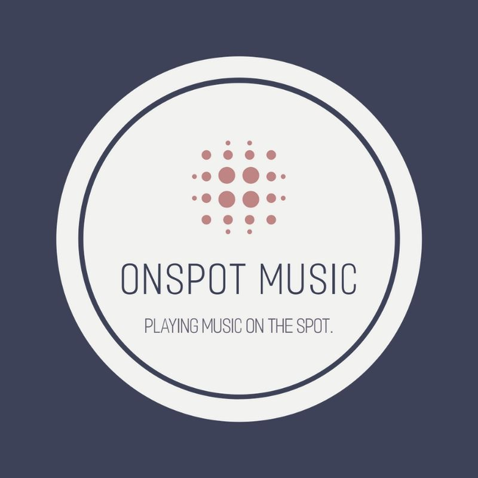

<h1 align="center">
     
    OnSpot Music - A free Discord music and audio bot
      
    
      
</h1>

<h3 align="center">
    🎶 A free music and audio bot for Discord. No locked functionality, free forever. Open source!
</h3>

    &nbsp;
    &nbsp;
    
     
    &nbsp;
    

## Adding the bot 🤖

To add the bot to your Discord server, click [here](https://discord.com/oauth2/authorize?client_id=1125742835946237992&permissions=0&scope=bot%20applications.commands). This will invite the bot to your Discord server.

Once the bot has joined your Discord server, there is no additional setup needed. Execute the **`/help`** command to view a list of commands to use.

## Hosting the bot yourself 🔓

**This bot is open-source, and if you want to host it yourself, here's how you can do it:**

1. Install [Node.js](https://nodejs.org/en/download/) v18.16 LTS.
2. Install [FFmpeg](https://ffmpeg.org/download.html) latest release build. Make sure you can run `ffmpeg` in your terminal, for Windows, add it to your PATH.
3. Clone this repository and install its dependencies using `npm install`. If you encounter any errors, try use `npm install --legacy-peer-deps`.
4. Use `npm run build` to build the project and convert typescript to javascript.
5. Setup your `.env` file in the root directory to configure bot token `DISCORD_BOT_TOKEN` and client id `DISCORD_APPLICATION_ID`. You obtain these from the [Discord developer portal](https://discord.com/developers/applications). The `.env.example` file provides an example configuration.
6. To make the commands accessible on Discord servers, deploy slash commands using `npm run deploy`.
7. Start the bot using `npm start`. If set up correctly, the bot should now be online and operational. You will need to invite it to a server, see [Adding your bot to servers](https://discordjs.guide/preparations/adding-your-bot-to-servers.html#bot-invite-links) article for help.

### Additional information:

-   If you want to override default config options, create a file `/config/local.js`. The options defined in this file will override the default configurable options in `/config/default.js`. See `/config/default.js` for all available options. You do not need to copy the whole `/config/default.js` file, only the options you want to override.
-   You can use `npm run deploy-pretty` and `npm run start-pretty` to get formatted, colorized output to console instead of JSON format. For this to work, you need the npm package `pino-pretty` installed, `npm install pino-pretty -g` to install it globally.
-   Logs are stored in `/logs` directory, you can configure the logging level to file and console in the configuration file.
-   For production use, we recommend using a process manager like `pm2` or similar to automatically restart it the process crashes. Here is a simple setup for `pm2`:
    -   Install `pm2` globally: `npm install pm2 -g`.
    -   In repository root directory, start the bot with `pm2 start ./dist/index.js --name "onspot-music"`.
    -   Save the process list with `pm2 save`.
    -   To view logs with `pino-pretty`, run `pm2 logs 0 --out --raw | pino-pretty`. _Note: Does not work well in Windows PowerShell, use command prompt (cmd) to view logs with `pino-pretty` using same command if you are using `pm2`_.

## Get help and support 🛟

Encounter an issue? Open an issue in this repository or join my [Discord server](https://discord.gg/mBnVrNkqj2) for assistance.

## Credits and acknowledgments 🎉

This project is made possible by using [discord.js](https://github.com/discordjs/discord.js/) and [discord-player](https://github.com/Androz2091/discord-player).

### Contributors
